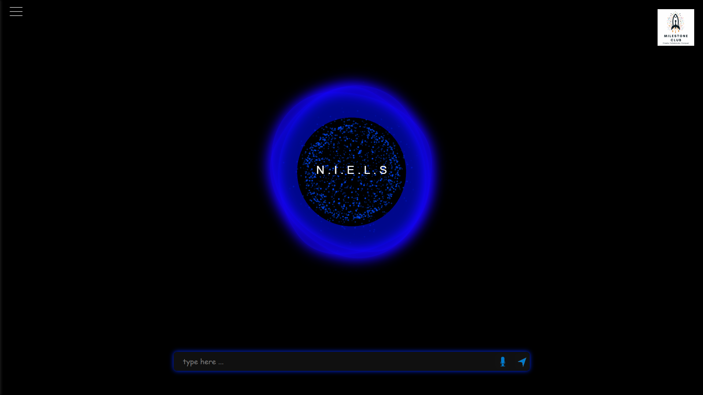
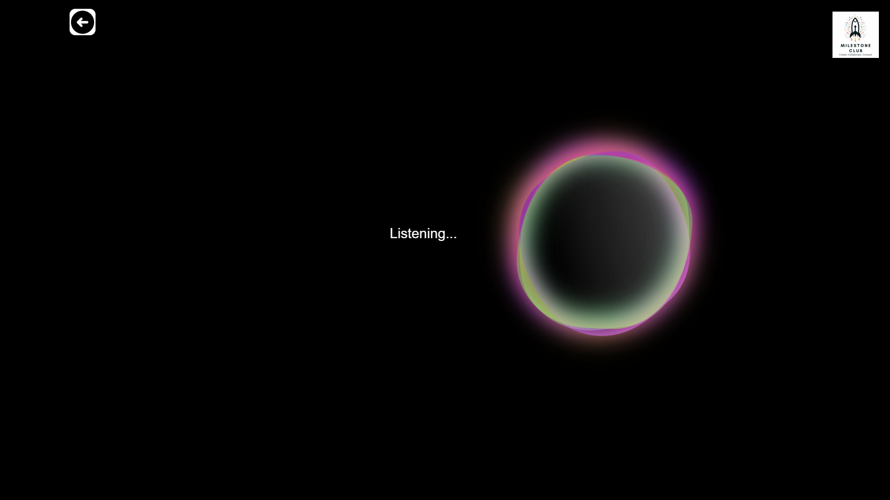

# NIELS - Virtual Assistant Prototype  

NIELS is an AI-powered virtual assistant named after **Niels Bohr**. This prototype version supports both **voice and text-based interactions**, assisting users with various tasks like **opening applications, making calls, generating AI responses**, and more.  

---

## 🚀 Features  
✔️ Voice & Text Chat Support  
✔️ Application Control (Open apps with commands)  
✔️ Call Making  
✔️ AI Responses  
✔️ Custom Hotword Activation (`.ppn` file for wake-word detection)  

---

## 📂 Folder Structure  
```
📆 Project Folder  
 ┓ 📂 frontend/      # UI and client-side code  
 ┓ 📂 backend/       # Server-side logic  
 ┓ 📂 notifs/        # Notifications-related functions  
 ┓ 📝 chat.html      # Chat interface  
 ┓ 📝 main.py        # Core functionality  
 ┓ 📝 run.py         # Execution script
```

---

## 🛠️ Installation  

### Prerequisites  
- **Python 3.10.10**  
- **Required dependencies** (listed in `requirements.txt`)  

### Steps  
1️⃣ **Clone the repository:**  
   ```bash
   git clone https://github.com/JayanthSrinivas06/Virtual_AI_assistant.git
   cd Virtual_AI_assistant
   ```
2️⃣ **Create a virtual environment:**  
   ```bash
   python -m venv env
   source env/bin/activate  # (Windows: env\Scripts\activate)
   ```
3️⃣ **Install dependencies:**  
   ```bash
   pip install -r requirements.txt
   ```
4️⃣ **Run the assistant:**  
   ```bash
   python run.py
   ```

---

## 📸 Screenshots

Here’s a preview of the assistant in action: 

Home Page:

Voice command Interface: 

---

## 🖥️ Tech Stack  
- **Frontend:** HTML, CSS, JavaScript  
- **Backend:** Python, eel  
- **Database:** SQLite 
- **Hotword Detection:** Porcupine `.ppn` file  

---

## 👥 Contributors  
| Name        | GitHub Profile |
|------------|---------------|
| Jayanth Srinivas Bommisetty  | [JayanthSrinivas06](https://github.com/JayanthSrinivas06) |
| Sarvan Dattu Perumalla | [Sarvan05](https://github.com/Sarvan05) |
| Kesava Parepalli | [KesavaParepalli](https://github.com/KesavaParepalli) |
| Aryan Puri | [Aryan-Puri-23](https://github.com/Aryan-Puri-23) |

---

## 📝 License  
This project is free to use, modify, and distribute without restrictions.  

---

## 🌐 Links  
- **Project Repository:** [GitHub Link](https://github.com/JayanthSrinivas06/Virtual_AI_assistant)

---

## ⚠️ Note  
This is a **limited task prototype** of NIELS. Improved versions with **new features and advanced NLP capabilities** are under development! 🚀
